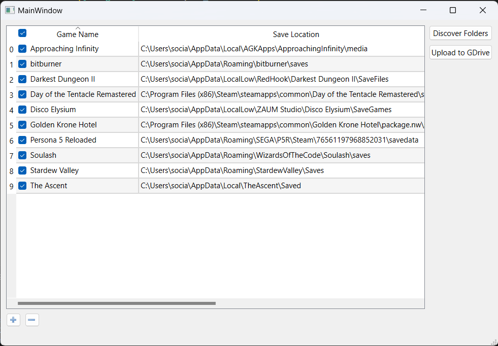

# Game Save Manager

[](./media/Screenshot.png)

## Overview

Save Duper is a tool designed to simplify the process of managing and backing up your game saves using the Google API. It features a user-friendly GUI built with PyQT, automated save discovery, and the ability to customize and organize your save folders.

## Features

- **Google Drive Integration:** Securely upload your game saves directly to Google Drive using the Google API.
  
- **Graphical User Interface (GUI):** The intuitive GUI, powered by PyQT, makes it easy to navigate and manage your game saves.

- **Automated Save Discovery:** Click the "Discover Folders" button to automatically identify and add game save folders. Alternatively, manually add or remove folders using the "+" and "-" icons.

- **Customization:** Double-click on the cell for the save location to modify it. Adjust game names if the folder discovery didn't get them right.

- **Selective Uploads:** Choose which games to upload by selecting the checkbox for each game and then hitting the "Upload" button.

- **Credentials:** For security, users need to generate their own credentials using the Google API and save them to a designated credentials folder.

## Getting Started

1. **Install Dependencies:**
   Ensure you have the required dependencies installed. You can install them using:

   ```bash
   pip install -r requirements.txt
2. **Generate Google API Credentials:**
	-   Create a project on the Google Developer Console.
	-   Enable the Google Drive API for your project.
	-   Create credentials (OAuth client ID) and download the JSON file.
	-   Save the downloaded JSON file to the `credentials` folder in the application directory.	
2.  **Run the Application:** Start the Game Save Manager by running:
    
    ```bash
    python frontend/application.py   
3.  **Discover and Manage Folders:**
    
    -   Click "Discover Folders" for automated discovery.
    -   Add custom folders with the "+" icon.
    -   Remove folders by clicking the "-" icon or double-clicking to edit.
4.  **Upload Game Saves:**
    
    -   Select desired games by checking the corresponding checkboxes.
    -   Click "Upload" to securely backup your game saves to Google Drive.

## Disclaimer

This tool is provided as-is, and users are responsible for their own credentials and data management.

## License

This project is licensed under the MIT License.

## Contributing

If you have ideas for improvements, bug fixes, or new features, feel free to open an issue or submit a pull request.
